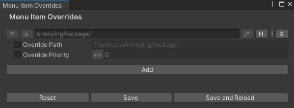

# Menu Item Overrides

Don't you just hate it when you install a few assets or packages and  then your menu ends up looking like one of those old Internet Explorer installations with like 20 toolbar extensions?

Looks pretty comparable to me.

**Well I have just the solution for you!**

With this package, you can turn that 👆 into this 👇!

## Configuration

With the package installed, you can open the Menu Item Overrides window by using the `Tools/Menu Item Overrides/Configuration` menu item.

This window allows you to add a list of overrides for menu items, which can modify the path of the menu item, the priority, or both.

- By pressing the `H` button, you can hide the menu item entirely.
- By enabling `Override Path`, you can specify a new location for the menu item.
- By enabling `Override Priority`, you can specify a new priority for the menu item. `+=` indicates that the specified priority is an offset and will be added to the original, and `=` indicates that the original priority will be overriden entirely.
- Paths ending in `/` are expected to be submenus, and will be treated as such (which will be indicated by the lit up `/*` on the right). Since submenus don't have their own priority, but instead are ordered based on their children, `+=` is the only availably priority override strategy for them. 

**Overrides are applied top-to-bottom**, meaning that the following two setups are equivalent:

## Dependencies

TBA

## Installation

TBA

## Known issues

Submenus seem to somehow be cached, so changing the priority override of a submenu will only take effect if the editor is restarted or if the submenu is moved, or hidden and unhidden.

## Getting involved

The project is pretty barebones now, so we welcome any and all contributions, whether it's reporting bugs, suggesting new features, or submitting code improvements.
